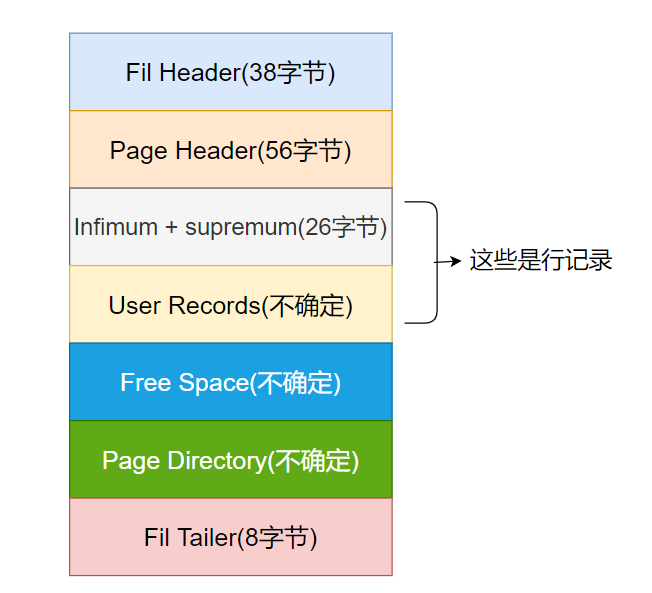
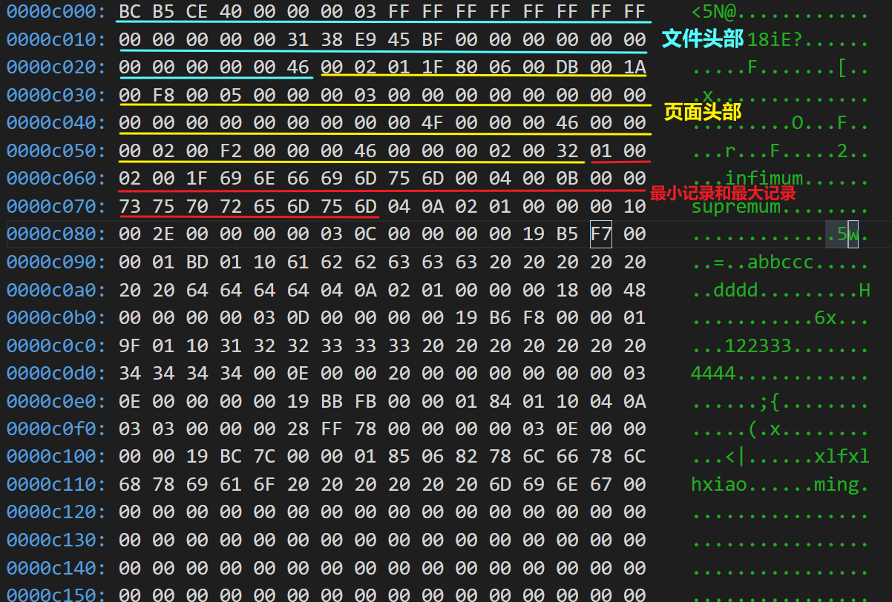
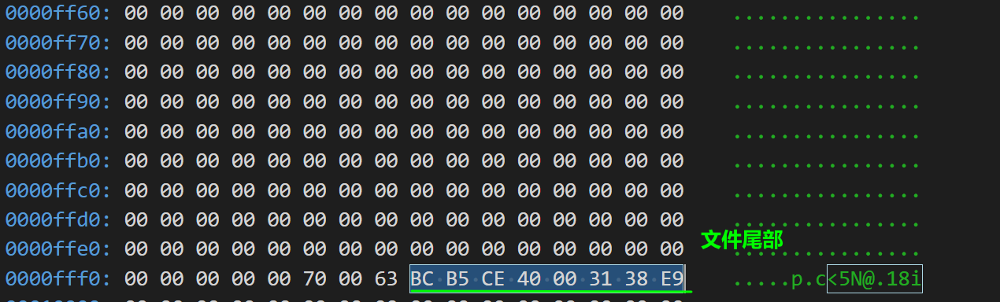
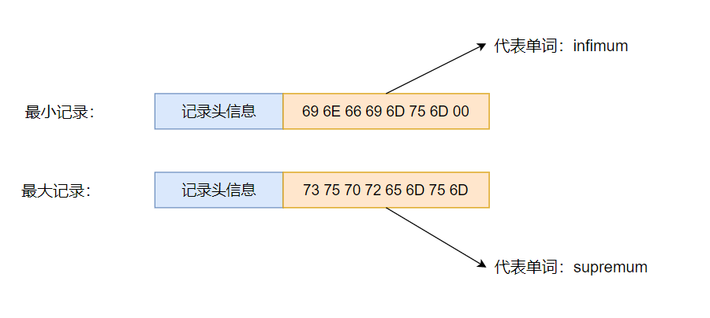
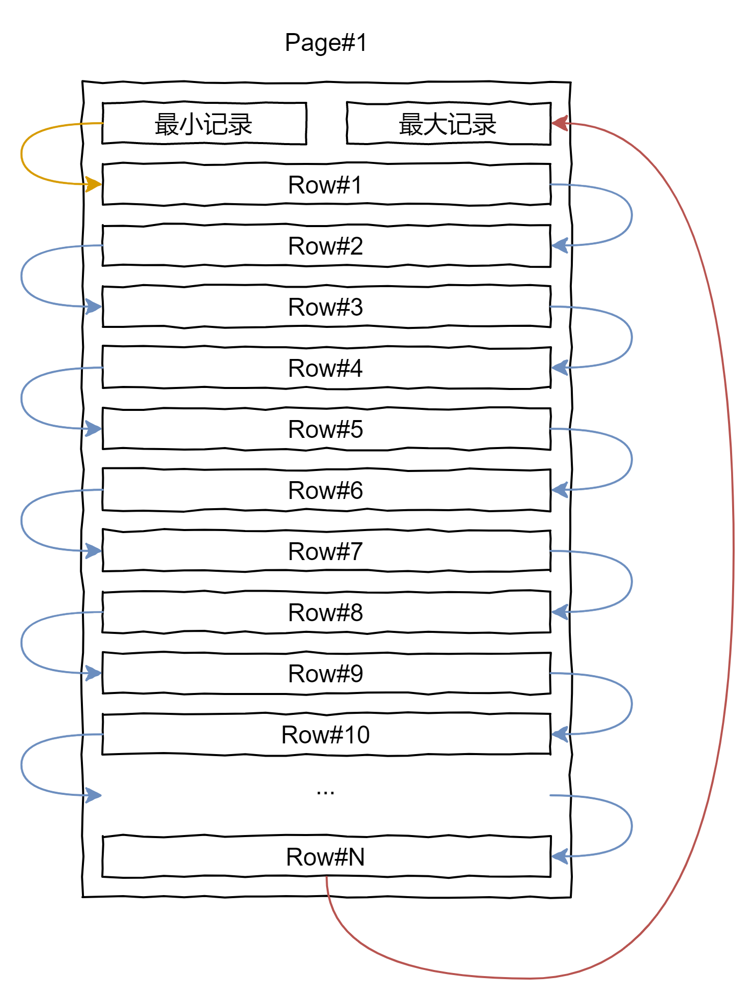
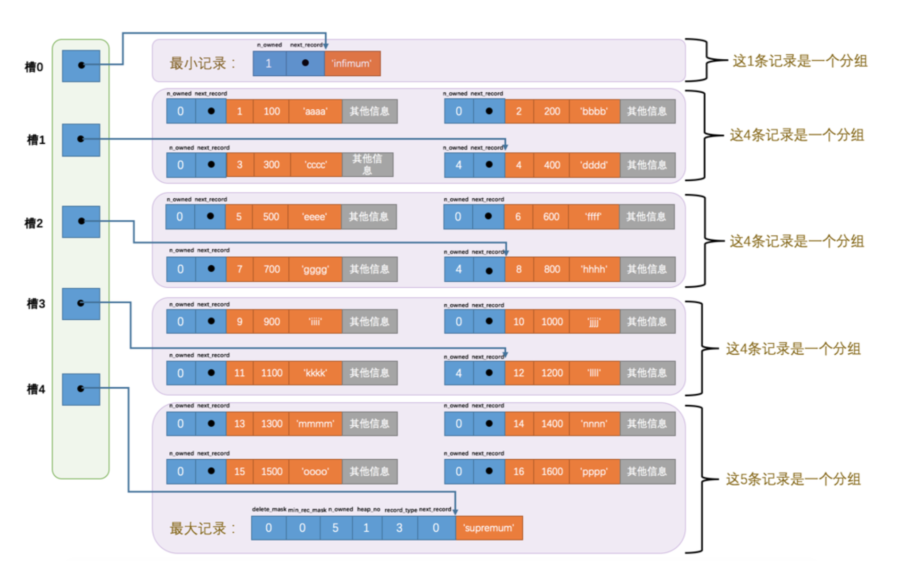

InnoDB数据页格式

<!-- more -->

页简介
---

页（page）是 InnoDB 管理存储空间的基本单位，一页大小一般为 `16KB` 

**页类型**

- 数据页（B-Tree Node）
- Undo页（Undo Log Page）
- 系统页（System Page）
- 事务数据页（Transaction System Page）
- 等等


数据页结构
---

一个 InnoDB 数据页的存储空间大概被划分为 7 个部分



- Fil Header（38 Bytes）               --头部文部           页的一些通用信息
- Page Header（56 Bytes）              --页面头部           数据页专有的一些信息
- Infimum + Supremum Records（26 Bytes）--最小记录和最大记录   两个虚拟的行记录
- User Records                        --用户记录           实际存储的行记录内容
- Free Space                          --空闲空间           页中尚未使用的空间
- Page Directory                      --页面目录           页中的某些记录的相对位置
- Fil Trailer（8 Bytes）               --文件尾部           校验页是否完整

一个页有两个头/尾对，其中，Fil Header 与 Fil Trailer 为一对，Page Header 与 Page Directory 为另一对。前者用于定义文件，为 fil 相关程序组所关心；后者用于定义页，为 page 相关程序组所关心。

> Fil 即 File

夹在头尾中间的部分，即记录（records）和空闲空间（free space）。一个页面总是以两个不变的记录 Infimum 和 Supremum 开始，接下来是用户记录。在**向下增长**的用户空间与**向上增长**的 Page Directory 之间，是提供给新记录的空间空间。

> 新创建的页面是不存在 User Records（用户记录）的，当插入第一条数据时，会从 Free Space 申请空间，才会出现这个部分。当 Free Space 被用完时，新插入的记录会放在新申请的数据页中。


## ibd 文件

Windows 下表空间数据存储在 *C:\ProgramData\MySQL\MySQL Server 5.7\Data\\[数据库名]\\[表名].ibd* 中。

借助 Visual Studio Code 的 hexdump 扩展，查看该文件。

当前表中数据内容如下：



首先查询当前的页大小：

```sql
mysql> show status like 'Innodb_page_size';
+------------------+-------+
| Variable_name    | Value |
+------------------+-------+
| Innodb_page_size | 16384 |
+------------------+-------+
1 row in set (0.00 sec)
```

当前的测试环境下 InnoDB 页大小为 16 KB。因此，ibd 文件每 16 KB 属于一个页。

第一个页的范围应当为 `0x0000000` ~ `0x00003ff0`。以此类推，我们把整个文件切分为多个 16 KB 部分。本文不讨论文件格式，因此直接定位到目标页，本次测试环境下是 `0x0000c000` 即第四页为测试数据存储位置。

上图分析：蓝色部分为 38 字节的 Fil Header，黄色为 56 字节的 Page Header，红色为 26 字节的 Infimum + Supremum 记录。

其后一部分就是数据, 绿色划线部分为 8 字节的 Fil Tailer




记录在页中的存储
---

InooDB 定义了两个伪记录分别维最小记录和最大记录（占 26 字节），都是由 `5` 字节大小的**记录头信息**和 `8` 字节大小的一个固定的部分组成，如下图



在一开始生成页的时候，其实并没有 User Record 这个部分，每当我们插入一条记录，都会从 Free Space 部分申请一个记录大小的空间划分到 User Records 部分，当 Free Space 部分使用完，就要申请新的页。

User Record 中的**记录按照主键的从小到大的顺序形成一个单链表 **( next_record )



> 规定: `Infimum ` 记录的下一条记录就是本页中**主键最小**的用户记录，
>
> 本页中主键最大的用户记录(next_record = 0)的下一条记录就是 `Supremum` 记录

不论怎么对页中的记录做增删改查操作，InnoDB **始终会维护一条记录的单链表**。

> 注：当数据页中存在多条被删除的记录时，这些记录的 next_record 属性将会把这些被删除的记录组成一个**垃圾链表**，以备之后重用这个部分存储。

Page Directory
---

页目录生成过程

- 将所有正常记录（包括最小记录和最大记录，不包括标记删除的记录）划分为几个**组**
- 每个组的**最后**一条记录（组内最大的那条记录）的头信息中 `n_owned` 属性表示该记录拥有多少条记录，也就是该组内有多少条记录
- 将每组的最后一条记录的**地址偏移量**（从页面的 0 字节开始数）单独提取出来按**顺序存储到靠近页的尾部**的地方（即 Page Directory）

> 页面目录中的这些**地址偏移量**被称为**槽**(Slot),所以**页目录就是由槽组成**。如下图所示



每个分组中记录条数规定:

 - 对于**最小记录**所在的分组只能由 `1` 条记录
 - **最大记录**所在分组拥有的记录数只能在 `1~8` 条
 - 剩下的分组记录数只能在 `4~8` 条


分组步骤：

 1. 初始情况下一个数据页里只有最小记录和最大记录两条记录，它们分属于两个分组。 
 2. 之后每插入一条记录，都会从**页目录**中找到主键值比本记录的主键值大并且差值最小的槽，然后把该槽对应的记录的 `n_owned` 值加 `1`，表示本组内又添加了一条记录，直到该组中的记录数等于 `8` 个。 
 3. 在一个组中的记录数等于 `8` 个后再插入一条记录时，会将组中的记录拆分成两个组，一个组中 `4` 条记录，另一 个 `5` 条记录。这个过程会在页目录中新增一个**槽**来记录这个新增分组中最大的那条记录的偏移量。


数据页中查找**指定主键值**的记录的过程分为两步:

1. 通过**二分法**确定该记录所在的槽，并找到该槽中主键值最小的那条记录。
2. 通过记录的 `next_record `属性遍历该槽所在的组中的各个记录。

Page Header
---

> 页面头部：占有固定的 `56` 字节，专门存储各种状态信息，例如存储了多少个槽，多少条记录等等

各个字节的作用如下表：

| 名称              | 占用空间的大小（字节） | 描述                                                         |
| ----------------- | :--------------------: | ------------------------------------------------------------ |
| PAGE_N_DIR_SLOTS  |           2            | 在页目录中的槽数量                                           |
| PAGE_HEAP_TOP     |           2            | 还未使用的空间最小地址，也就是说从该地址之后就是 Free Space  |
| PAGE_N_HEAP       |           2            | 本页中的记录的数量(包括最小和最大记录以及标记为删除的记录)   |
| PAGE_FREE         |           2            | 第一个已经标记为删除的记录地址(各个已删除的记录通过 next_record 也会组成一个单链 表，这个单链表中的记录可以被重新利用) |
| PAGE_GARBAGE      |           2            | 已删除记录占用的字节数                                       |
| PAGE_LAST_INSERT  |           2            | 最后插入记录的位置                                           |
| PAGE_DIRECTION    |           2            | 记录插入的方向                                               |
| PAGE_N_DIRECTION  |           2            | 一个方向连续插入的记录数量                                   |
| PAGE_N_RECS       |           2            | 该页中记录的数量(不包括最小和最大记录以及被标记为删除的记录) |
| PAGE_MAX_TRX_ID   |           8            | 修改当前页的最大事务 ID，该值仅在二级索引中定义              |
| PAGE_LEVEL        |           2            | 当前页在 B+ 树中所处的层级                                   |
| PAGE_INDEX_ID     |           8            | 索引 ID，表示当前页属于哪个索引                              |
| PAGE_BTR_SEG_LEAF |           10           | B+ 树叶子段的头部信息，仅在 B+ 树的 Root 页定义              |
| PAGE_BTR_SEG_TOP  |           10           | B+ 树非叶子段的头部信息，仅在 B+ 树的 Root 页定义            |

File Header
---

> 文件头部记录这页面的通用信息，例如页的编码，上一页，下一页等等，占用固定字节 `38`

| 名称                             | 占用空间大小（字节） | 描述                                                         |
| -------------------------------- | :------------------: | ------------------------------------------------------------ |
| FIL_PAGE_SPACE_OR_CHKSUM         |          4           | 页的校验和(checksum值)                                       |
| FIL_PAGE_OFFSET                  |          4           | 页号                                                         |
| FIL_PAGE_PREV                    |          4           | 上一个页的页号                                               |
| FIL_PAGE_NEXT                    |          4           | 下一个页的页号                                               |
| FIL_PAGE_LSN                     |          8           | 页面被最后修改时对应的日志序列位置(英文名是:Log Sequence Number) |
| FIL_PAGE_TYPE                    |          2           | 该页的类型                                                   |
| FIL_PAGE_FILE_FLUSH_LSN          |          8           | 仅在系统表空间的一个页中定义，代表文件至少被刷新到了对应的LSN值 |
| FIL_PAGE_ARCH_LOG_NO_OR_SPACE_ID |          4           | 页属于哪个表空间                                             |

> 每个数据页中的 File Header 部分上有上一个和下一个页编号，数据页会组成一个**双链表**

`FIL_PAGE_OFFSET `： 每一个页都有一个单独的页号，就跟你的身份证号码一样， InnoDB 通过页号来可以**唯一定位一个页** 

File Trailer
---

> File Trailer 检测一个页是否完整，由 8 个字节组成
>

这 8 个字节可以分为两个部分

- 前 4 个字节代表页的校验和
  - 这个部分适合 File Header 中的校验和相对应。
- 后 4 个字节代表页面最后被修改时对应的日志序列位置（LSN）

..
---

- 每个记录的头信息中都有一个 `next_record` 属性，从而使页中的所有记录串联成一个**单链表**
- 每个数据页中的 File Header 部分上有上一个和下一个页编号，数据页会组成一个**双链表**

