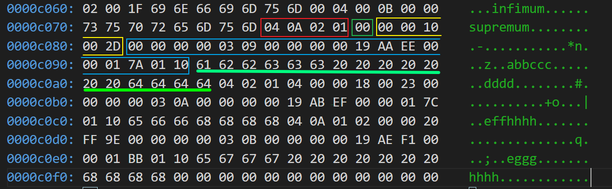

InnoDB 行格式。 

<!-- more -->

行格式的概念 
---

**表的行格式**（Row Formats）是指行记录在磁盘上的物理存储方式。行格式会影响查询和 DML 操作的性能，随着单个磁盘页面中容纳更多行，查询（queries）和索引查找（index lookups）可以更快地进行，缓冲池中需要的缓存内存空间会更少，写入更新值所需的 I/O 也更少。 

每个表中的数据被划分为**页**（pages），每个页中有一个或多个行记录。构成每个表的页面排列在称为 B+ 树索引的数据结构中。表数据（聚集索 引）和二级索引都使用这种类型的结构。


> MySQL 提供了很多长度可变的数据类型，比如 `VARCHAR(M)、 VARBINARY(M)` 以及 `TEXT` 等。这些变长类型的列被称为变长字 段，其中存储的字节大小是不固定的，因此必须通过记录一些额外信息来处理这些变长字段。


**变长字段**是列值存储在 B+ 树索引节点中的规则的一个例外（即变长字段 内容不一定全在 B+ 树叶子结点中）。太长而不适合 B+ 树页面的可变长度列存储在单独分配的磁盘页面上，称为**溢出页**。此类列称为**页外列**。 页外列的值存储在溢出页面的单向链接列表中，每个这样的列都有自己的 一个或多个溢出页面列表。根据列长度，可变长度列值的全部或前缀存储 在 B+ 树中，以避免浪费存储空间和读取单独的页面。


InnoDB 支持四种行格式，特性各不相同：

- REDUNDANT 
- COMPACT 
- DYNAMIC 
- COMPRESSED


|    行格式    | 紧凑的存储特性 | 增强的可变长度列存储 | 大索引键前缀 支持 | 压缩支 持 |        支持的表空间类型         |     所需文件格式      |
| :----------: | :------------: | :------------------: | :---------------: | :-------: | :-----------------------------: | :-------------------: |
| `REDUNDANT`  |       No       |          No          |        No         |    No     | system, file-per-table, general | Antelope or Barracuda |
|  `COMPACT`   |      Yes       |          No          |        No         |    No     | system, file-per-table, general | Antelope or Barracuda |
|  `DYNAMIC`   |      Yes       |         Yes          |        Yes        |    No     | system, file-per-table, general |       Barracuda       |
| `COMPRESSED` |      Yes       |         Yes          |        Yes        |    Yes    |     file-per-table, general     |       Barracuda       |


变量 `innodb_default_row_format `定义了默认使用的格式（默认为 DYNAMIC），而在建表（CREATE）或修改表（ALTER）时，也可以使用 ROW_FORMAT 选项自定义。

COMPACT
---

COMPACT 行格式的结构如下图


其中，**变长字段长度列表**、NULL 值列表和记录头信息属于数据之外的额外信息。 

### 变长字段长度列表

**变长字段长度列表**顾名思义，存储的是变长字段的长度，它按照逆序存储 变长列的字节数。例如行中有三列（均为变长类型），从左到右为 c1、 c2、c3，长度分别为 1 字节、2 字节、4字节，那么变长字段长度列表 中存储的就是 0x040201。 

当然这里有一个问题，那就是如果变长字段的长度 1 字节存不下怎么办。 InnoDB 按照一定的规则去处理这些情况。 

对于不同的编码方式，相同字符占用的空间不一定相同，事先约定，某字符集单个字符占用的最大字节数为 MaxLen，例如 UTF-8 编码的 `MaxLen `就是 3 (**这是mysql特有的，真实的utf-8编码长度为1~4字节**)。对于变长类型来说，它们一般是限制字符数量而不是字节数量，因此，VARCHAR(M) 最多能够存储 M 个字符，即 ` M * MaxLen` 个字节。这里假设实际存储的字符串的字节数为 Length。有了 这三个变量，可以设定以下规则。 

- 当 `M * MaxLen = 255`，使用 `1` 字节来存储变长字段长度。
- 当 `M * MaxLen > 255`，分情况讨论： 
  - `Length = 127`，使用 `1` 字节来存储变长字段长度。 
  - `Length > 127`，使用 `2 `字节来存储变长字段长度。

#### 特例

1. 变长字段长度列表**不存储值为 NULL 的长度信息**，会在 NULL 的标志位存储；
2. 变长字段长度列表**不一定能存在**,例如
   - 表中无变长字段
   - 变长字段值为 NULL
3. 变长字段长度列表**各字段的长度信息逆序存储**
4. char类型字段的长度信息是否需要存储在 变长字段的长度列表 中取决于其所使用的**字符集是否为变长字符集**
   - MySQL中 `char(M)` 类型的字段表示该字段最多可以存储 **M 个字符**。
   - 对于定长字符集(如 ascii 字符集)而言，compact 行格式下存储该字段所占有的空间固定为 `M x Maxlen` 个字节。
   - 但是对于变长字符集而言情况就大不一样了，例如 utf8 字符集，其存储 `M ` 个字符所需的空间为 `M~3M` 个字节。
   - 在compact行格式下，char类型字段会由于使用变长字符集而导致其所占的**字节数(即长度信息)不定**，故此时 char 类型的数据同样也需要在变长字段的长度列表中存储其长度信息


### NULL值列表

- 二进制位的值为 1 时，代表该列的值为 NULL
- 二进制位的值为 0 时，代表该列的值不为 NULL
- MySQL 规定 NULL 值列表必须用整数个字节的位表示
- 不一定每列都存在 NULL 值标志


### 记录头信息


固定为 `5` 个字节

- **预留位1、2**【2 bit】：暂未使用
- **delete_mask**【1 bit】：当前记录被删除的标志位
- **min_rec_mask**【1 bit】：B+树的每层非叶子节点中的最小记录的标志位
- **n_owned**【4 bit】：当前记录拥有的记录数
- **heap_no**【13 bit】：当前记录在记录堆中的位置
- **record_type**【3 bit】：当前记录类型。具体地，0: 普通记录；1:  B+ 树非叶子节点记录（即所谓的目录项记录）；2: 最小记录；3: 最大记录
- **next_record**【16 bit】：下一条记录的相对位置

> next_record 指针指向**记录头信息和真实数据之间的位置**,后面的页格式会用到

### 记录真实数据

1. 隐藏列【19字节】

- **DB_ROW_ID**：该字段占 6 个字节，用于标识一条记录，【不一定存在，只有在用户没有定义主键时，且没有唯一且不为 NULL 的列】
- **DB_TRX_ID**：该字段占 6 个字节，其值为事务 ID
- **DB_ROLL_PTR**：该字段占 7 个字节，其值为回滚指针

2. 真实列 1，2，3，4

### 实例分析

#### 建表并插入数据

```sql
DROP TABLE IF EXISTS `demo1`;
CREATE TABLE `demo1`  (
  `test1` varchar(10),
  `test2` varchar(10),
  `test3` char(10),
  `test4` varchar(10)
) ENGINE = InnoDB CHARACTER SET = utf8 COLLATE = utf8_general_ci ROW_FORMAT = COMPACT;

INSERT INTO `demo1` VALUES ('a', 'bb', 'ccc', 'dddd');
INSERT INTO `demo1` VALUES ('e', 'ff', NULL, 'hhhh');
INSERT INTO `demo1` VALUES ('e', NULL, 'ggg', 'hhhh');
```

#### 找到数据所在位置（ idb 文件）



#### 分析

只分析第一行数据

**红色的部分** 为 变长字段长度列表，04 0A 02 01 转为十进制是 `4 10 2 1`, 因为是逆序存储, 所以变长字段的长度应该为`1 2 10 4` 正好对应'a'[varchar], 'bb'[varchar], 'ccc'[char(10)], 'dddd'[varchar]，至于为什么定长 char 类型也存在其中（请看特例的第四点）这里不再解释。

**绿色的部分** 为 NULL 值标志位，`00` 代表没有空值

**黄色的部分** 为固定 5 字节大小的记录头信息，`00 00 10 00 2D`


REDUNDANT
---

`REDUNDANT` 格式是 MySQL 5.0 之前的版本使用的行记录格式，其后版本提供该格式是为了向后兼容（兼容旧版本）。 


> REDUNDANT 格式是非常原始的行格式，目前已经很少使用了，其**占用空间最多，内存碎片化最严重，性能较差**。


REDUNDANT 的格式如下图。


> ***Redundant*** 是 MySQL 5.0 之前的行结构，于 Compact 的主要区别是字段偏移量长度、 NULL 值列表等


### 字段长度偏移列表

> 包含了所有列（包括隐藏列）的长度信息，它是首先计算各列的长度信息，然后依次累加，最后逆序存储。

字段长度偏移列表中每个偏移量所占字节要么全是1字节或者 2 字节。

- 当记录数据内容的整个部分数据（包括隐藏列）所占空间小于 `127` 字节,则各偏移量只需要 `1` 个字节
- 当其所占空间超过 `127` 字节但是小于`32767`字节，则各偏移量需要 `2` 字节
  - 该记录会通过**记录头信息**的 **1byte_offs_flag** 属性来表明该记录各偏移量的字节数，以便读取记录的时候方便解析

注意：

- 字段长度偏移列表包含 NULL 值标志
  - 偏移量的第一位实际上是没有使用的，其用于标识该记录下相应列是否为 NULL 值，如果是 NULL 值，则该位为 1；反之，则为 0

### 记录头信息

> 记录头信息用于描述该条记录，其固定为 6 个字节，即 48 位


- **预留位1、2**：暂未使用
- **delete_mask**【1 bit】：当前记录被删除的标志位
- **min_rec_mask**【1 bit】：B+ 树的每层非叶子节点中的最小记录的标志位
- **n_owned**【4 bit】：当前记录拥有的记录数
- **heap_no**【13 bit】：当前记录在记录堆中的位置
- **n_field**【10 bit】：表示记录中**列的数量**
- **1byte_offs_flag**【1 bit】：**标识字段长度偏移列表中各列的偏移量使用的字节数。0：意为每个偏移量均使用 2 个字节表示；1：意为每个偏移量均使用 1 个字节表示**
- **next_record**【16 bit】：下一条记录的相对位置


行溢出
---

众所周知，InnoDB 存储引擎中内存与硬盘交互的基本单位是页，一般地页大小为`16KB`。MySQL 规定一个页中至少需要存放两条记录。

而所谓的**行溢出**是指：当某个记录的某个字段(varchar、text、blob等类型)的值长度过长、数据量过大，会导致一个页中放不下一条记录，为此在compact、redundant行格式中，如果该记录某字段中数据量过多时，则在该记录的数据内容的相应字段处只存储该字段值**前768个字节**的数据和一个指向存储剩余数据的其他页（即所谓的**溢出页**）的**地址**，该地址通常占用**20个字节**

> 通俗的说就是如果数据量过多，数据内容部分只存 **768个前缀字节** 和 **20字节的指针**（指的是 REDUNDANT 和 COMPACT）

  

COMPRESSED 和 DYNAMIC 行记录格式
---

Innodb 1.0 之后引入新的文件格式（file format,可以理解为新的页格式）。

> 以前支持 COMPACT 和 REDUNDANT 格式称为 `Antelop` 文件格式，新的文件格式称为`Barracuda`文件格式（包含了两种新的行记录格式：COMPRESSED 和 DYNAMIC)。

新的两种记录格式对于存放 `BLOB ` 中的数据采用了**完全行溢出**方式(数据页中只存放 **20 字节的指针**，实际数据都存放在 `Off Page`)


Compressed行记录格式的另一个功能，存储在其中的数据会以 `zlib` 的算法进行压缩（对 BLOB、TEXT、VARCHAR 这种特别有用）


### DYNAMIC

**DYNAMIC**行格式提供了与**COMPACT**行格式相同的存储特性，但为变长字段长度列添加了增强的存储功能，并支持大索引键前缀。


当使用 ROW_FORMAT=`DYNAMIC`创建表，InnoDB 可以存储`fully off-page`的变长字段长度列值（用于 VARCHAR、VARBINARY、BLOB 和 TEXT 类型），聚集索引记录只包含指向**溢出页面的20字节指针**。大于或等于`768`字节的固定长度字段被编码为可变长度字段。例如，如果字符集的最大字节长度大于3，则 char(255） 列可能超过768字节， utf8mb4 就是如此。


> 列是否在页外存储取决于页面大小和行的总大小。当一行太长时，会选择最长的列进行页外存储，直到聚集索引记录适合 B+ 树页面。小于或等于40字节的 [`TEXT`](https://dev.mysql.com/doc/refman/5.7/en/blob.html) and `BLOB` 列存储在行中。


`DYNAMIC`行格式保持了在索引节点中存储整行的效率（`COMPACT` 和`REDUNDANT` 格式也是如此），但`DYNAMIC`行格式避免了用大量长列数据字节填充 B+ 树节点的问题。

`DYNAMIC`行格式基于这样的思想：如果长数据值的一部分存储在页外，则通常最有效的方法是在**页外存储整个值**。使用 DYNAMIC 格式，较短的列可能保留在 B+ 树节点中，从而最大限度地减少给定行所需的溢出页数。


>DYNAMIC 行格式支持最多`3072`字节的索引键前缀。此功能由`innodb_large_prefix`变量控制，该变量在默认情况下处于启用状态。


### COMPRESSED

`COMPRESSED`行格式提供了与`DYNAMIC`行格式相同的存储特性和功能，但增加了对**表和索引数据压缩**的支持


`COMPRESSED`行格式使用与`DYNAMIC`行格式类似的页外存储内部详细信息，并从压缩的表和索引数据中考虑额外的存储和性能，使用较小的页面大小。对于压缩行格式，`KEY_BLOCK_SIZE`选项控制在聚集索引中存储多少列数据，以及在溢出页上存储多少列数据。


>COMPRESSED行格式支持最多`3072`字节的索引键前缀。此功能由`innodb_large_prefix`变量控制，该变量在默认情况下处于启用状态。


使用`COMPRESSED`行格式的表可以在每个表的**文件表空间**或**常规表空间**中创建。**系统表空间不支持压缩行格式**。要在每个表空间的文件中存储压缩表，必须启用`innodb_file_per_table`变量，并且必须将`innodb_file_format`设置为`Barracuda`。innodb_file_per_表和innodb_file_格式变量不适用于常规表空间。通用表空间支持所有行格式，但需要注意的是，**由于物理页大小不同，压缩表和未压缩表不能在同一个通用表空间中共存**。


总结
---

### Antelop 文件格式

#### Redundant

- 记录额外信息
  - 字段偏移长度列表
  - 记录头信息
- 记录真实信息（包含隐藏列）

这种行格式存储已经**基本不使用**了，占用空间最多，内存碎片化最严重，性能较差

#### COMPACT

- 记录额外信息

  - 变长字段长度列表

  - NULL 值列表

  - 记录头信息

- 记录真实数据（包含隐藏列）


### Barracuda 文件格式

加入了 DYNAMIC 和 COMPRESSED 新的行格式存储

#### Dynamic 和 Compressed

- 类似 Compact 行格式，只不过在存储数据发生溢出时的处理方式不一样，Dynamic 是在记录真实数据哪里只存储20字节的页地址，所有字节都存到其他页面中。
- Compressed 行格式会采取压缩算法对页面进行压缩

