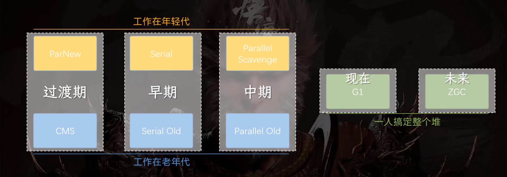
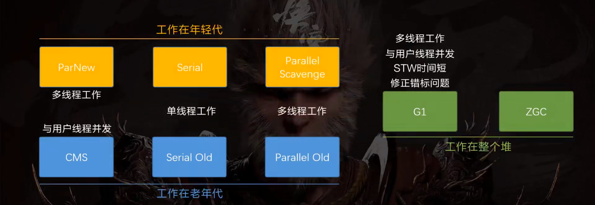

JVM垃圾回收机制(GC)。

<!-- more -->

垃圾回收器
---

### 判断对象是否已死

- **引用计数算法**：在对象中添加一个引用计数器，在被引用的时候就加一，当引用失效时，就减一；当引用计数器为0时就是代表该对象不会在被引用。缺点：无法解决对象之间的相互引用问题。

- **可达性分析算法**：从根节点集合"GC Root Set" 开始，根据引用关系向下搜索，搜索过程的路径称为"引用链"，无法到达的就意味着是垃圾。

  

固定可作为GC Roots的对象包括：

1. 栈帧中的本地变量表中引用的对象；
2. 方法区中类静态属性引用的对象；
3. 方法区中常量引用的对象；
4. 本地方法栈中JNI引用的对象；
5. Java虚拟机内部的引用；
6. 所有被同步锁（synchronized）持有的对象；
7. 反应Java虚拟机内部情况JMXBean、JVMTI中注册的回调、本地代码缓存等。

### 引用（reference）

- 强引用：普遍存在的引用赋值，只要引用关系还在，GC 永远不会回收被引用的对象,eg:" Object obj = new Object( )  "；
- 软引用：一些有用，但非必须的对象，会在内存溢出之前，被列入第二次回收对象列中；
- 弱引用：描述那些非必须的对象，强度比软引用更弱一点，只能存活到下一次垃圾收集发生之前；
- 虚引用：最弱的一种引用关系，为对象设置该引用唯一目的是为了在这个对象被GC回收时收到一个系统通知。 虚引用必须和引用队列（ReferenceQueue）联合使用

### 堆内存常见的分配策略

- 对象优先进入Eden区分配
  - 当Eden内存几乎被分配完全了，如果此时再为其他的对象分配内存，虚拟机就会发起一次Minor GC,如果之前的对象无法存入幸存区，只能通过**分配担保机制**将新生代的对象提前转移到老年代中
- 大对象直接进入老年代
  - 为什么要这样——为了避免大对象分配内存由于分配担保机制带来的复制导致降低效率
- 长期存活的对象进入老年代
  - 虚拟机给每个对象一个对象年龄(Age) 计数器

### 生存后死亡

即使在可达性分析法中不可达的对象，也并非是“非死不可”的，这时候它们暂时处于“缓刑阶段”，要真正宣告一个对象死亡，至少要经历两次标记过程；可达性分析法中不可达的对象被第一次标记并且进行一次筛选，筛选的条件是此对象是否有必要执行 finalize 方法。当对象没有覆盖 finalize 方法，或 finalize 方法已经被虚拟机调用过时，虚拟机将这两种情况视为没有必要执行。

被判定为需要执行的对象将会被放在一个队列中进行第二次标记，除非这个对象与引用链上的任何一个对象建立关联，否则就会被真的回收。

### 如何判断一个常量是废弃常量

运行时常量池主要回收的是废弃的常量。那么，我们如何判断一个常量是废弃常量呢?

假如在常量池中存在字符串"abc" ,如果当前没有任何String对象引用该字符串常量的话，就说明常量"abc"就是废弃常量,如果这时发生内存回收的话而且有必要的话，" abc"就会被系统清理出常量池。

### 如何判断一个类是无用的类

方法区主要回收的是无用的类，那么如何判断一个类是无用的类的呢？

判定一个常量是否是“废弃常量”比较简单，而要判定一个类是否是“无用的类”的条件则相对苛刻许多。类需要同时满足下面 3 个条件才能算是 **“无用的类”** ：

- 该类所有的实例都已经被回收，也就是 Java 堆中不存在该类的任何实例。
- 加载该类的 `ClassLoader` 已经被回收。
- 该类对应的 `java.lang.Class` 对象没有在任何地方被引用，无法在任何地方通过反射访问该类的方法。

虚拟机可以对满足上述 3 个条件的无用类进行回收，这里说的仅仅是“可以”，而并不是和对象一样不使用了就会必然被回收。

### 垃圾收集算法

#### 分代收集理论

分代算法：根据对象存活周期的不同将内存划分为几块，一般是新生代和老年代，新生代基本采用复制算法，老年代采用标记整理算法。

- 部分收集（Partial GC）
  - 新生代收集（Minor GC/Young GC）
  - 老年代收集（Major GC/Old GC）
  - 混合收集（Mixed GC）		

- 整堆收集（Full GC）：收集整个Java堆和方法区的垃圾收集

#### 标记-清除算法

标记阶段是把所有活动对象（可达对象，reachable）都做上标记的阶段。 清除阶段是把那些没有标记的对象，也就是非活动对象回收的阶段。

缺点：

- 执行效率不稳定
- 内存空间碎片化问题

#### 标记-复制算法

它将内存按容量分为大小相等的两块，每次只使用其中的一块（对象面），当这一块的内存用完了，就将还存活着的对象复制到另外一块内存上面（空闲面），然后再把已使用过的内存空间一次清理掉。

缺点：

- 内存缩小一半，空间浪费太多

#### 标记-整理算法

该算法标记的过程与标记—清除算法中的标记过程一样，但对标记后出的垃圾对象的处理情况有所不同，它不是直接对可回收对象进行清理，而是让所有的对象都向一端移动，然后直接清理掉端边界以外的内存

### 垃圾收集器

