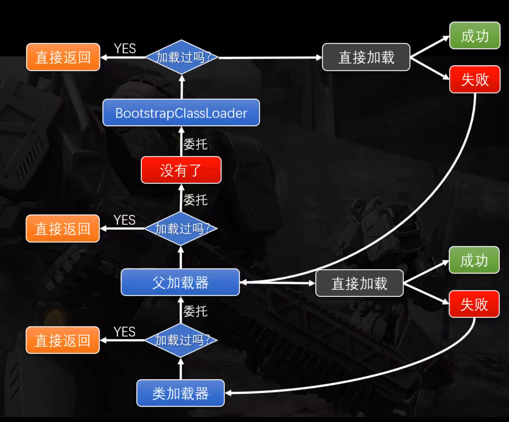

JVM类加载机制

<!-- more -->

类加载机制
---

### 类的加载时机（触发条件）

- 使用new关键字实例化对象
- 读取或设置一个类型的静态字段
- 调用一个类型的静态方法的时候
- 反射（使用java.lang.reflect包的方法对类型进行反射调用）
- 初始化一个类的子类（会首先初始子类的父类）
- JVM启动标明的启动类，即文件名和类名相同的那个类

### 类的加载过程

- 加载 (Loading)
- 验证(Verification)
- 准备(Preparation)
- 解析(Resoultion)
- 初始化(Initialization)
- 使用(Using)
- 卸载(UnLoading)

注意：静态变量在准备阶段只进行创建；静态常量在准备阶段就会进行初始化

### 类的加载器(ClassLoader)

- 启动类加载器( Bootstrap )：加载存放在lib目录下的jar包、或被-Xbootclasspath参数指定指向的路径中存放的jar包
- 扩展类加载器( Extension )：加载lib\ext下的jar包
- 应用程序类加载器( Application )：加载用户类路径（ClassPath）上所有类库
- 自定义类加载器( Custom )：继承classLoader，重写findClass方法

### 双亲委派模型

简单的来说，类加载器永远要先请示上级，上级会请示它的上级，除非所有上级都做不了，这件事才轮到你来

加载过程

**不可重写String类**
