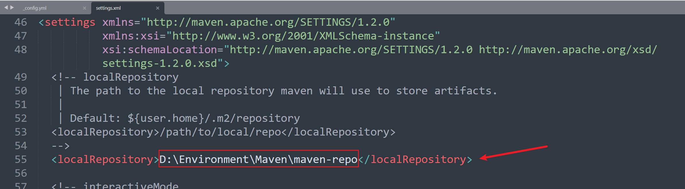

Java 环境配置，主要有 JDK 1.8、Maven 和 Tomcat。

<!-- more -->

## JDK

### 安装

> 注：使用 zip 安装的，jdk exe转换为zip(https://bgasparotto.com/convert-jdk-exe-zip)

### 新建系统变量

变量名：JAVA_HOME

变量值：D:\Environment\JDK\jdk-8 (注：jdk 安装路径)

### 编辑系统变量中的Path

>新增:
>%JAVA_HOME%\bin
>%JAVA_HOME%\jre\bin

### 验证

```shell
java -version
javac -version
```


## Maven

### 下载

地址：https://maven.apache.org/download.cgi

### 配置环境变量

新建系统变量：

	变量名：Maven_Home
	变量值：D:\Environment\Maven\apache-maven-3.8.1

编辑系统变量中的Path

	新增：%Maven_Home%\bin

注：验证是否配置成功 `mvn -v`

### 配置本地仓库

1、在安装目录的同级目录下新建一个文件夹 maven-repo(`文件名随意`)，如下

```shell
.
├── apache-maven-3.8.1
└── maven-repo
```

2、修改配置为本地仓库地址，增加如图所示一行（配置文件在conf下）



```xml
<localRepository>D:\Environment\Maven\maven-repo</localRepository>
```


### 修改源

在setting.xml文件中，找到 <misrrors> 标签，修改如下，以`阿里云仓库`为例

```xml
<mirrors>
    <mirror>
      <id>nexus-aliyun</id>
      <mirrorOf>central</mirrorOf>
      <name>Nexus aliyun</name>
      <url>http://maven.aliyun.com/nexus/content/groups/public</url>
	</mirror>
    <mirror>
      <id>maven-default-http-blocker</id>
      <mirrorOf>external:http:*</mirrorOf>
      <name>Pseudo repository to mirror external repositories initially using HTTP.</name>
      <url>http://0.0.0.0/</url>
      <blocked>true</blocked>
    </mirror>  
</mirrors>
```


## Tomcat

### 下载

地址：https://tomcat.apache.org/download-10.cgi

### 配置环境变量

新建系统变量

```
变量名：CATALINA_HOME
变量值：D:\Environment\Tomact\apache-tomcat-9.0.52

变量名：CLASSPATH
变量值：.;%JAVA_HOME%\lib\dt.jar;%JAVA_HOME%\lib\tools.jar;
```

编辑系统变量中Path

```
%CATALINA_HOME%\lib
%CATALINA_HOME%\bin
```

