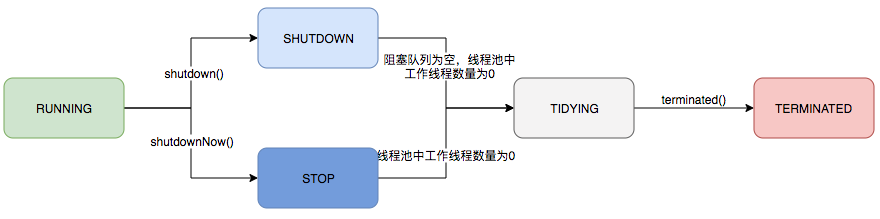

java 多线程

<!-- more -->

多线程的创建
---

1. 继承Thread类【不建议】
   - 继承Thread类
   - 重写run方法

```java
class MyThread extends Thread{
    @Override
    public void run() {
        System.out.println(Thread.currentThread().getName()+"执行了");
    }

}

public class ThreadDemo01 {
    public static void main(String[] args) throws InterruptedException {
        MyThread thread = new MyThread();
        thread.setName("子线程");
        thread.start();
        System.out.println(Thread.currentThread().getName()+"执行了");
    }
}

//main执行了
//子线程执行了
```


2. 实现Runnable【推荐】
   - implements Runnable
   - 重写run方法
   - 传进Thread()中

```java
public class RunnableDemo {
    public static void main(String[] args) {
        MyRunnable runnable = new MyRunnable();
        Thread thread = new Thread(runnable,"runnable");
        thread.start();
        System.out.println(Thread.currentThread().getName());
    }
}

class MyRunnable implements Runnable{
    @Override
    public void run() {
        System.out.println(Thread.currentThread().getName()+"执行了");
    }
}
```

3. 实现Callable
   - 实现Callable，重写call方法
   - 创建线程池，Executors.newCachedThreadPool()
   - submint
   - shutdown

```java
public class CallableDemo {
    public static void main(String[] args) throws ExecutionException, InterruptedException {
        MyCallable myCallable = new MyCallable();
        ExecutorService executor = Executors.newCachedThreadPool();
        Future<Boolean> submit = executor.submit(myCallable);
        System.out.println(submit.get());
        executor.shutdown();
        System.out.println(Thread.currentThread().getName());
    }
}

class MyCallable implements Callable<Boolean> {

    @Override
    public Boolean call() throws Exception {
        System.out.println(Thread.currentThread().getName());
        return true;
    }
}

//结果
pool-1-thread-1
true
main

```


静态代理
---

总的来说：

 - **真实对象** 和 **代理对象** 都要实现同一个接口；
 - **代理对象** 要代理 **真实对象**

特点：

 - 代理对象能做很多真实对象不能做的事情
 - 真实对象专注完成自己的

 

> 通过Runnable实现多线程，就使用了静态代理【new Thread(new MyRunnable))】


## 线程状态（6个）

1. new 【新建】
2. running 【可运行】
3. blocked 【阻塞】
4. waiting 【等待】
5. timed waiting 【定时等待】
6. terminated 【死亡】

> 获取线程状态方法，Thread.getState();


线程停止的方法
---

1. 正常停止
2. 利用标志位停止


## Tread中的部分方法

- void join() --- 等待终止指定的线程

> 【插队】

```java
public class DemoJoin {
    public static void main(String[] args) throws InterruptedException {
        Thread thread = new Thread(new TestJoin());
        thread.setName("插队");
        thread.start();
        for (int i = 0; i <= 5; i++) {
            System.out.println(Thread.currentThread().getName()+":"+i);
            if(i == 3){
                thread.join();
            }
        }
    }
}

class TestJoin implements Runnable{
    @Override
    public void run() {
        for (int i = 0; i <= 5; i++) {
            System.out.println(Thread.currentThread().getName()+":"+i);
        }
    }
}

//run
main:0
main:1
main:2
main:3
插队:0
插队:1
插队:2
插队:3
插队:4
插队:5
main:4
main:5

Process finished with exit code 0
```


- void join(long millis)  --- 等待指定的线程终止 或 等待经过指定秒数

- Thread.State getState() --- 线程状态

- void stop() --- 停止该线程（已废弃）

- void suspend() --- 暂停这个线程的执行（已废弃）

- void resume() --- 恢复线程（已废弃）

- static void yield() --- 静态方法，交出运行权

> yield---【礼让】
>
> 虽然交出了运行资源，但是下个运行**线程**还是要看 **CPU ** 调度

## 线程状态转化

New　－－－＞　Runnable

- 调用start()方法，进入Runnable，等待cup时间片

- 一个线程不能重复调用start()即，**线程死亡之后不可重复调用**【start方法中有检测线程状态】

  > start()方法源码

  ```java
  public synchronized void start() {
      if (threadStatus != 0)
          throw new IllegalThreadStateException();
  
      group.add(this);
  
      boolean started = false;
      try {
          start0();
          started = true;
      } finally {
          try {
              if (!started) {
                  group.threadStartFailed(this);
              }
          } catch (Throwable ignore) {
  
          }
      }
  }
  ```

blocked

- 试图获得锁，会进入blocked


守护线程daemon
---

> - Thread.setDaemon();
>
> - 每个程序都有守护线程如**gc**等
> - jvm不需要等待守护线程的结束，就可以退出了

## 中断线程

void interrupt() --- 向线程发送中断请求，线程的中断状态设置为true（默认false）

static boolean interrupted()  --- 测试当前线程是否被中断，会将中断状态设置重置为false

boolean isInterrupted() --- 测试线程是否被中断

static Thread currentThread() --- 返回当前正在执行的线程Thread对象


## 进程间的通信方式

1. 锁和同步
2. 等待/通知机制
3. 信号量
4. 管道
5. 其它方法：
   - join()
   - sleep()
   - ThreadLocal类


线程池
---

### 重要的类和接口
>
>| 类                          | 用途                                                         |
>| :-------------------------- | :----------------------------------------------------------- |
>| ExecutorService             | 真正实现线程池的接口                                         |
>| ScheduledExecutorService    | 能和Timer/TimerTask类似，解决那些需要任务重复执行的问题。    |
>| ThreadPoolExecutor          | ExecutorService的默认实现。                                  |
>| ScheduledThreadPoolExecutor | 继承ThreadPoolExecutor的ScheduledExecutorService接口实现，周期性任务调度的类实现 |


> Executor----**接口**

```java
public interface Executor {
    
    void execute(Runnable command);
    
}
```


> Executors --- 提供静态工厂方法用于创建各种线程池的**类**

```java
public class Executors {
    //创建固定数量的线程池
    public static ExecutorService newFixedThreadPool(int nThreads) {
        return new ThreadPoolExecutor(nThreads, nThreads,
                                      0L, TimeUnit.MILLISECONDS,
                                      new LinkedBlockingQueue<Runnable>());
    }
    
    public static ExecutorService newWorkStealingPool(int parallelism) {
        return new ForkJoinPool
            (parallelism,
             ForkJoinPool.defaultForkJoinWorkerThreadFactory,
             null, true);
    }
  
    public static ExecutorService newWorkStealingPool() {
        return new ForkJoinPool
            (Runtime.getRuntime().availableProcessors(),
             ForkJoinPool.defaultForkJoinWorkerThreadFactory,
             null, true);
    }
    //创建固定数量的线程池
    public static ExecutorService newFixedThreadPool(int nThreads, ThreadFactory threadFactory) {
        return new ThreadPoolExecutor(nThreads, nThreads,
                                      0L, TimeUnit.MILLISECONDS,
                                      new LinkedBlockingQueue<Runnable>(),
                                      threadFactory);
    }
    //创建一个单线程的线程池
    public static ExecutorService newSingleThreadExecutor() {
        return new FinalizableDelegatedExecutorService
            (new ThreadPoolExecutor(1, 1,
                                    0L, TimeUnit.MILLISECONDS,
                                    new LinkedBlockingQueue<Runnable>()));
    }
    //创建一个单线程的线程池
    public static ExecutorService newSingleThreadExecutor(ThreadFactory threadFactory) {
        return new FinalizableDelegatedExecutorService
            (new ThreadPoolExecutor(1, 1,
                                    0L, TimeUnit.MILLISECONDS,
                                    new LinkedBlockingQueue<Runnable>(),
                                    threadFactory));
    }
    //创建一个可缓存的线程池
    public static ExecutorService newCachedThreadPool() {
        return new ThreadPoolExecutor(0, Integer.MAX_VALUE,
                                      60L, TimeUnit.SECONDS,
                                      new SynchronousQueue<Runnable>());
    }
    //创建一个可缓存的线程池
    public static ExecutorService newCachedThreadPool(ThreadFactory threadFactory) {
        return new ThreadPoolExecutor(0, Integer.MAX_VALUE,
                                      60L, TimeUnit.SECONDS,
                                      new SynchronousQueue<Runnable>(),
                                      threadFactory);
    }

    public static ScheduledExecutorService newSingleThreadScheduledExecutor() {
        return new DelegatedScheduledExecutorService
            (new ScheduledThreadPoolExecutor(1));
    }
    
    public static ScheduledExecutorService newSingleThreadScheduledExecutor(ThreadFactory threadFactory) {
        return new DelegatedScheduledExecutorService
            (new ScheduledThreadPoolExecutor(1, threadFactory));
    }
    
    ......
}
```


> ExecutorsService --- 线程池定义的**接口**，继承Excutor，用于线程的操作【shutdown】

```java
public interface ExecutorService extends Executor {
	//关闭
    void shutdown();

    List<Runnable> shutdownNow();
	//判断
    boolean isShutdown();

    boolean isTerminated();

    boolean awaitTermination(long timeout, TimeUnit unit)  throws InterruptedException;
	//提交
    <T> Future<T> submit(Callable<T> task);

    <T> Future<T> submit(Runnable task, T result);

    Future<?> submit(Runnable task);
	
    <T> List<Future<T>> invokeAll(Collection<? extends Callable<T>> tasks) throws InterruptedException;

    <T> List<Future<T>> invokeAll(Collection<? extends Callable<T>> tasks,long timeout, TimeUnit unit)
        throws InterruptedException;

    <T> T invokeAny(Collection<? extends Callable<T>> tasks) throws InterruptedException, ExecutionException;

    <T> T invokeAny(Collection<? extends Callable<T>> tasks, long timeout, TimeUnit unit)
        throws InterruptedException, ExecutionException, TimeoutException;
}

```

### ThreadPoolExecutor 

> ThreadPoolExecutor 是ExecutorService的默认实现
>
> 构造方法中参数介绍
>
> - corePoolSize : 核心池的大小
> - maximumPoolSize : 线程池最大线程数
> - keepAliveTime : 表示线程没有任务执行时最多保持多久时间会终止
> - unit : 参数keepAliveTime的时间单位
> - workQueue : 一个阻塞队列，用来存储等待执行的任务
> - threadFactory : 线程工厂，主要用来创建线程；
> - handler : 表示当拒绝处理任务时的策略
>   - ThreadPoolExecutor.AbortPolicy:丢弃任务并抛出RejectedExecutionException异常。 
>   - ThreadPoolExecutor.DiscardPolicy：也是丢弃任务，但是不抛出异常。 
>   - ThreadPoolExecutor.DiscardOldestPolicy：丢弃队列最前面的任务，然后重新尝试执行任务（重复此过程）
>   - ThreadPoolExecutor.CallerRunsPolicy：由调用线程处理该任务 

```java
//只取了ThreadPoolExecutor的四个构造方法
public class ThreadPoolExecutor extends AbstractExecutorService {
    .....

 	public ThreadPoolExecutor(int corePoolSize,
                              int maximumPoolSize,
                              long keepAliveTime,
                              TimeUnit unit,
                              BlockingQueue<Runnable> workQueue) {
        this(corePoolSize, maximumPoolSize, keepAliveTime, unit, workQueue,
             Executors.defaultThreadFactory(), defaultHandler);
    }
    
    public ThreadPoolExecutor(int corePoolSize,
                              int maximumPoolSize,
                              long keepAliveTime,
                              TimeUnit unit,
                              BlockingQueue<Runnable> workQueue,
                              ThreadFactory threadFactory) {
        this(corePoolSize, maximumPoolSize, keepAliveTime, unit, workQueue,
             threadFactory, defaultHandler);
    }
 
    public ThreadPoolExecutor(int corePoolSize,
                              int maximumPoolSize,
                              long keepAliveTime,
                              TimeUnit unit,
                              BlockingQueue<Runnable> workQueue,
                              RejectedExecutionHandler handler) {
        this(corePoolSize, maximumPoolSize, keepAliveTime, unit, workQueue,
             Executors.defaultThreadFactory(), handler);
    }
 	//前三个最终都调用了这个方法
    public ThreadPoolExecutor(int corePoolSize,
                              int maximumPoolSize,
                              long keepAliveTime,
                              TimeUnit unit,
                              BlockingQueue<Runnable> workQueue,
                              ThreadFactory threadFactory,
                              RejectedExecutionHandler handler) {
        if (corePoolSize < 0 || maximumPoolSize <= 0 || maximumPoolSize < corePoolSize || keepAliveTime < 0)
            throw new IllegalArgumentException();
        if (workQueue == null || threadFactory == null || handler == null)
            throw new NullPointerException();
        this.acc = System.getSecurityManager() == null ?null : AccessController.getContext();
        this.corePoolSize = corePoolSize;
        this.maximumPoolSize = maximumPoolSize;
        this.workQueue = workQueue;
        this.keepAliveTime = unit.toNanos(keepAliveTime);
        this.threadFactory = threadFactory;
        this.handler = handler;
    }
    ...
}
```


### 实例创建线程池

> newCachedThreadPool -- 创建一个可缓存的线程池，若线程数超过处理所需，缓存一段时间后会回收，若线程数不够，则新建线程

```java
public class PoolDemo {
    public static void main(String[] args) {
        ExecutorService executorService = Executors.newCachedThreadPool();
        for (int i = 0; i < 20; i++) {
            executorService.execute(()->{
                System.out.println(Thread.currentThread().getName());
            });
        }
        executorService.shutdown();

    }
}
```

> newFixedThreadPool --- 创建一个固定大小的线程池，可控制并发的线程数，超出的线程会在队列中等待

```java
class FixedThreadDemo{
    public void run(){
        ExecutorService executorService = Executors.newFixedThreadPool(5);
        for (int i = 0; i < 30; i++) {
            executorService.execute(()->{
                System.out.println(Thread.currentThread().getName());
            });
        }
        executorService.shutdown();
    }
}
```

> newSingleThreadPool -- 创建一个单线程的线程池，可保证所有任务按照指定顺序(FIFO, LIFO, 优先级)执行

```java
class SingleThreadDemo{
    public void run(){
        ExecutorService executorService = Executors.newSingleThreadExecutor();
        for (int i = 0; i < 30; i++) {
            executorService.execute(()->{
                System.out.println(Thread.currentThread().getName());
            });
        }
        executorService.shutdown();
    }
}
```


> newScheduledThreadPool -- 创建一个周期性的线程池，支持定时及周期性执行任务

```java
class ScheduledThreadDemo{
    public void run(){
        ScheduledExecutorService executorService = Executors.newScheduledThreadPool(3);
        System.out.println(" 提交任务");
        for (int i = 0; i < 10; i++) {
            final int index = i;
            executorService.schedule(() -> {
                // 获取线程名称,默认格式:pool-1-thread-1
                System.out.println(Thread.currentThread().getName() + " " + index);
            }, 3, TimeUnit.SECONDS);
        }
        executorService.shutdown();
    }
}
```


> ThreadPoolExecutor -- 【推荐使用，根据需求创建合适的线程池】

```java
class ThreadPoolExecutorDemo{
    public void run() throws InterruptedException {
        ExecutorService executorService = new ThreadPoolExecutor(100, 1000,
                1, TimeUnit.MINUTES, new ArrayBlockingQueue<>(5, true),
                Executors.defaultThreadFactory(), new ThreadPoolExecutor.AbortPolicy());
        for (int i = 0; i < 2000; i++) {
            executorService.execute(()->{
                System.out.println(Thread.currentThread().getName());
            });
            sleep(2);
        }
        executorService.shutdown();
    }
}
```


重要知识点
---

### 使用线程池的好处

- **降低资源消耗**：通过池化的技术重复利用被创建的线程，降低线程创建和销毁造成的开销
- **提高响应速度**：当任务到达时，无需等待线程创建即可立即执行
- **提高线程的可管理性**：**线程是稀缺资源**，如果无限制创建，不仅会消耗系统资源，还会因为线程的不合理分布导致资源调度失衡，降低系统的稳定性。**使用线程池可以进行统一的分配、调优和监控**。
- **提供更强大的功能**：线程池具备可拓展性，允许开发人员向其中增加更多的功能


### 线程池解决的核心问题

> 线程池解决的核心问题就是**资源管理问题**
>

在并法的环境下，系统不确定在任意时刻中，有多少任务需要执行，有多少资源需要投入。这样的不去确定性会带来问题：

1. 频繁申请/销毁资源和调度资源，将带来**额外的消耗**，可能会非常巨大。
2. 对资源无限申请缺少抑制手段，**易引发系统资源耗尽的风险**。
3. 系统无法合理管理内部的资源分布，会降低**系统的稳定性**。

为解决资源分配这个问题，线程池采用了“池化”（Pooling）思想


### ThreadPoolExecutor是如何运行

线程池的运行主要分成两部分：任务管理、线程管理。


### 生命周期管理

线程池内使用一个变量维护两个变量：**运行状态**(runState)和**线程数量** (workerCount--有效线程数)

线程池有五种状态：

1. RUNNING     -- 能接收新提交的任务，也可以处理阻塞队列的任务
2. SHUTDOWN    -- 关闭状态，不可以接收新的任务，但是可以继续处理阻塞队列的任务
3. STOP        -- 不接收新的任务，也不处理阻塞队列中的任务，会中断正在处理任务的线程
4. TIDYING     -- 所有任务都终止了，workerCount（有效线程数）为 0
5. TERMINATED   -- 在terminated（）方法之后进入这个状态


生命周期的转化



### 任务调度

> 所有任务的调度都是由**execute方法**完成的

执行过程如下：

1. 首先检查线程池的状态，如果不是Running，直接拒绝执行
2. 如果workerCount < corePoolSize ,则创建并启动一个线程来执行该任务
3. 如果workerCount >= corePoolSize && 阻塞队列未满，则将该任务放入阻塞队列中
4. 如果workerCount >= corePoolSize && workerCount < maximumPoolSize ,且阻塞队列已满，则创建并启动一个线程来执行该任务
5. 如果workerCount >= maximumPoolSize ,并且线程池内的阻塞队列已满，则根据**拒绝策略来处理该任务**, **默认的处理方式是直接抛异常**

### 拒绝策略

当线程数量大于maximumPoolSize，就会执行拒绝策略。ThreadPoolExecutor类中一共有4种拒绝策略。

通过实现**RejectedExecutionHandler**接口。

- AbortPolicy【终止策略】 ： 线程任务丢弃报错。默认饱和策略。
- DiscardPolicy 【丢弃策略】： 线程任务直接丢弃不报错。
- DiscardOldestPolicy 【丢弃阻塞队列中的最老策略】： 将workQueue**队首任务丢弃**，将最新线程任务重新加入队列执行。
- CallerRunsPolicy 【直接调用run方法】：线程池之外的线程直接调用run方法执行。
