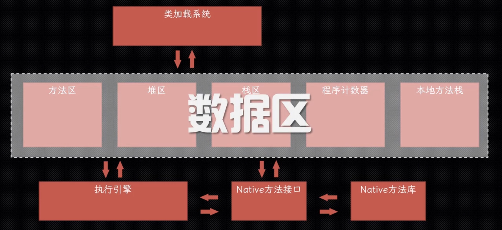
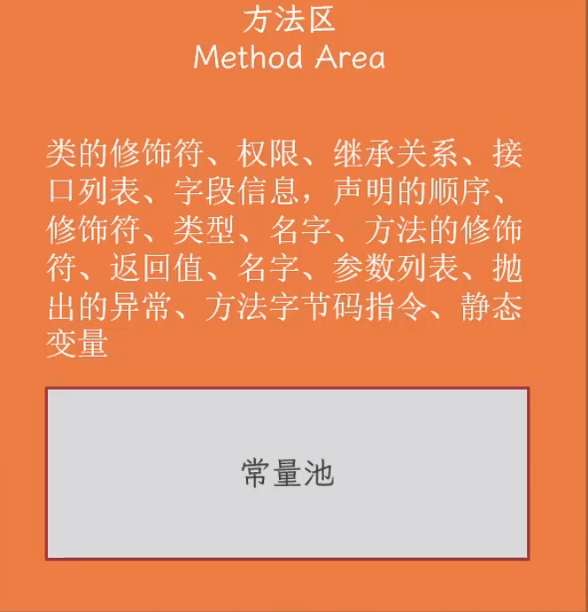
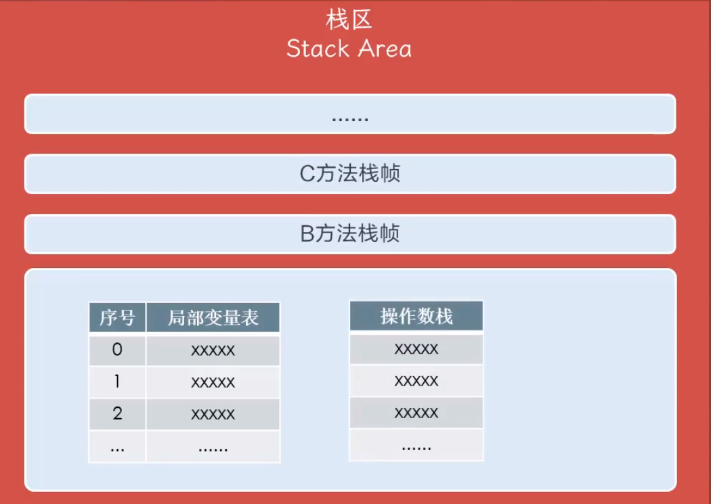
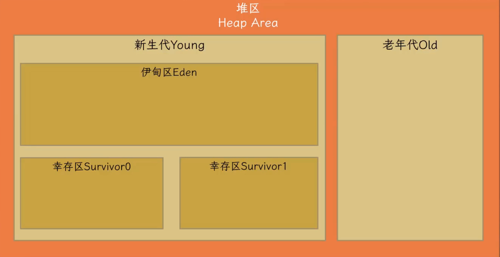

内存结构

<!-- more -->

JVM内存结构
---

### JVM 运行时内存结构图

所有线程共享：

- 方法区（Method Area)：也叫元空间，用于存储已被虚拟机加载的类型信息、常量、静态变量、即时编译器编译后的代码缓存的数据【**运行时的常量池也是方法区的一部分**】

  

- 堆区（Heap Area）：占的最大，存放Java**对象的实例**

线程私有（线程独立）：

- 栈区（Stack Area)：每个方法被执行的时候，都会同步创建一个**栈帧**（Stack Frame）用于存储**局部变量表、操作数栈**、动态连接、方法出口等

  

- 程序计数器（Program Counter Register）：一块较小的内存空间，可以看作当前线程所执行的字节码的行号指示器

- 本地方法栈（Native Method Area）：调用本地方法，和栈区通过本地方法接口（JNI）通信

### 堆区（Heap Area)

- 新生代（Young）：又分伊甸区（Eden)、两个幸存区（From Survivor, To  Survivor)
- 老年代（Old）：

