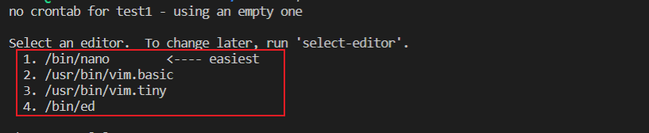

Linux 一些功能

<!-- more -->

crontab 定时任务
---

1.编辑定时任务

```shell
crontab -e
```



> 第一次会弹出编辑器选择，建议选择 /usr/bin/vim.basic 编辑器，选错了可以使用 select-editor 重新选择

cron 表达式不会可以去 [crontab guru](https://crontab.guru/) 网站

格式：

```shell
0 7 * * *  python3 index.py >> /tmp/test.txt
cron 表达式 运行的指令 日志保存地址
```

2.查看定时任务

```shell
cront
```


