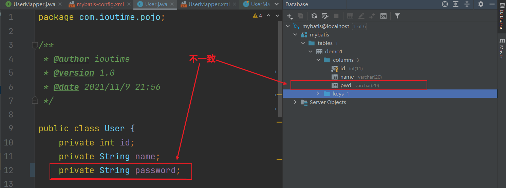
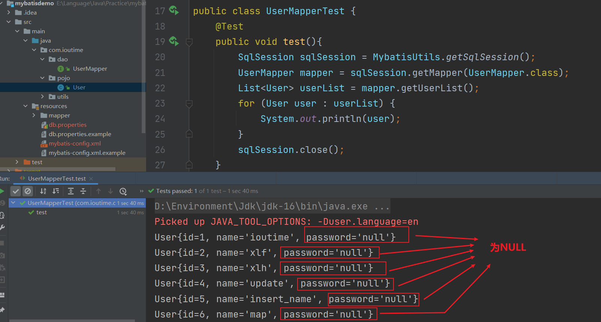
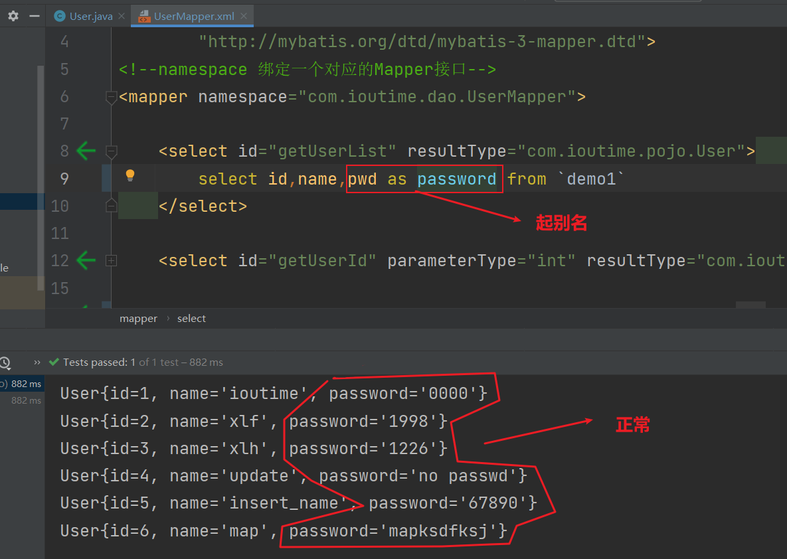
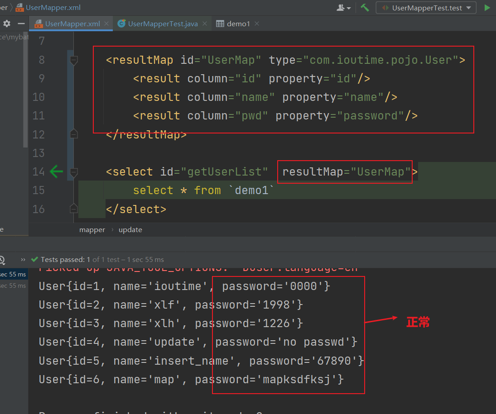

MyBatis学习笔记

<!-- more -->

什么是MyBatis
---

- MyBatis 是一款优秀的**持久层**框架，它**支持自定义 SQL、存储过程以及高级映射**。
- MyBatis 免除了几乎所有的 JDBC 代码以及设置参数和获取结果集的工作。
- MyBatis 可以通过**简单的 XML** 或**注解**来配置和**映射原始类型**、接口和 Java POJO（Plain Old Java Objects，普通老式 Java 对象）为数据库中的记录。

> 映射

> 持久化

数据持久化：

- 持久化就是将程序的数据在持久状态和瞬间状态转化的过程
- 内存：断电即失
- 数据库（jdbc），io文件持久化

因为内存断电即失，有一些对象不能丢失。

> 持久层

Dao层、Service层、Controller层......

- 完成持久化工作的代码块
- 层界限明显

为什么需要MyBatis
---

- 帮助程序员将数据存到数据库中
- 方便，传统的JDBC代码太复杂，简化，框架，自动化

MyBatis 优缺点
---

优点：

- 基于 SQL 语句的编程，灵活，SQL 写在 XML 里，**解除了 sql 与代码的耦合**，便于统一管理；**提供 XML 标签**，支持编写**动态 SQL语句**，并且可以重用
- MyBatis 基本免除了 jdbc 的代码以及参数配置，结果获取等等
- MyBatis 兼容很多数据库（采用 jdbc 连接）
- 提供**映射标签**，支持对象与数据库的 **ORM 字段关系映射**；提供**对象关系映射标**签，支持对象关系组件维护

缺点：

- 移植性差
- sql 语句的编写工作量大

> XML 标签

> 动态 sql 语句

> **对象关系映射**（英语：**Object Relational Mapping**），是一种程序设计技术，用于实现**面向对象编程**语言里**不同类型系统的数据之间的转换**

MyBatis 解决了 jdbc 那些问题
---

- 数据库链接的**创建、释放**频繁造成资源浪费
  - 解决：在 `SqlMapConfig.xml` 中配置数据库链接池，使用**连接池管理数据库连接**
  - 常用数据库连接池：`dbcp `、`c3p0` 等等

- sql 语句写在代码中造成代码不易维护
  - 解决：将 Sql 语句配置放在 `XXXmapper.xml` 文件中与Java代码分离
- sql 语句传参数麻烦
  - 解决：**MyBatis 自动将 java 对象映射至 sql 语句**
- 对结果集解析麻烦
  - 解决: **MyBatis 自动将 sql 执行结果映射至 Java 对象**

> mybatis 使用的是什么数据库连接池

> MyBatis 自动将 java 对象映射至 sql 语句

> MyBatis 自动将 sql 执行结果映射至 Java 对象

MyBatis 编程步骤
---

1. 创建 `SqlSessionFactory`
2. 通过 SqlSessionFactory 创建 `SqlSession`
3. 通过 SqlSession 执行数据库操作
4. 调用 session.`commit`() 提交事务
5. 调用 session.`close`() 关闭会话

#{} 和 ${} 的区别
---

|           | #{}                                                          | ${}                                                       |
| --------- | ------------------------------------------------------------ | --------------------------------------------------------- |
| 功能      | 是`占位符`，预编译处理                                       | 是`拼接符`，字符串替换，没有预编译处理，容易出现 sql 注入 |
| 传入值    | 传入的参数是以**字符串**传入，会将 Sql 语句中的 #{} 替换成 ？ 号，调用`PerparedStatement` 的 `set` 赋值 | 是**原值**传入，相当与 jdbc 的 Statement 编译             |
| 替换之后  | 变量自动加上**单引号**                                       | 不加单引号                                                |
| `sql`注入 | 可以防止                                                     | 不可以                                                    |
| DBMS      | 变量替换是在 `DBMS` 中                                       | 在 `DNMS` 外                                              |

> DBMS: 数据库管理系统, `database management system`

Dao 接口的工作原理
---

> Dao 接口即 Mapper 接口。

1. 接口的**全限名**就是映射文件中的 `namespace` 的值
2. 接口的**方法**就是映射文件中 Mapper 的 Statement 的 id 值
3. 接口方法内的**参数**就是**传递给 sql 的参数**
4. Mapper 接口没有实现类，调用接口方法时，接口全限名+方法名拼接的字符串作为 key 值，可唯一定位一个 MapperStatement

Dao 接口中的**方法不能重载**，看第四点。

Dao 接口的工作原理：jdk 的**动态代理**

- mybatis 运行时会使用动态代理为 Dao 接口生成代理 proxy 对象
- 代理对象 proxy 会**拦截接口方法**，转而执行 `MapperStatement` 所代表的 sql 语句，然后将 sql 执行结果返回

> 动态代理
>
> 静态代理

Mapper 中如何传多个参数
---

1. #{0}...#{1}...
2. 使用 @Param 注解
3. 封装为 Map ,如 HashMap 的形式传递到 Mapper 中

MyBatis 动态 sql 语句
---

Mybatis 动态 sql 可以在 xml 映射文件内，以**标签的形式**编写动态 sql 语句；

执行原理：根据表达式的值完成逻辑判断，并动态拼接 sql 功能

提供 `9` 种动态 sql 标签：trim 、 where 、 set、foreach、if、choose、when、otherwise、bind

Mybatis 实现一对一方式
---

> 有联合查询和嵌套查询两种方式。 

- 联合查询是几个表联合查询，通过在 resultMap 里面配置 `association `节点配置一对一的类就可以完成;
- 嵌套查询是先查一个表，根据这个表里面的结果的外键id，再去另外一个表里面查询数据，也是通过 association配置，但另外一个表的查询是通过select配置的。

Mybatis实现一对多方式
---

> 有联合查询和嵌套查询两种方式。

- 联合查询是几个表联合查询，只查询一次，通过在 resultMap 里面的 `collection `节点配置一对多的类就可以完成;
- 嵌套查询是先查一个表，根据这个表里面的结果的外键id，再去另外一个表里面查询数据，也是通过 `collection`，但另外一个表的查询是通过 select 配置的。

Mybatis 一级和二级缓存
---

-  一级缓存:基于 `PerpetualCache `的 `HashMap` 本地缓存，其存储作用域为 `Session`，当Session flush 或close之后，该Session中的所有Cache就将清空，**默认打开一级缓存**。
- 二级缓存与一级缓存机制相同，默认也是采用PerpetualCache，HashMap存储，不同在于其存储 作用域为 `Mapper`(namespace)，并且可自定义存储源，如Ehcache。默认打不开二级缓存，要开启二级缓存，使用二级缓存属性类需要**实现 Serializable 序列化接口**(可用来保存对象的状态)，可在它的 映射文件中配置。

对于缓存数据更新机制，当某一个作用域(一级缓存Session/二级缓存Namespace)进行了增/删/改操 作后，默认该作用域下所有select中的缓存将被clear。

MyBatis 调用 Mapper 接口有哪些要求
---

- Mapper接口方法名和mapper.xml中定义的每个sql的id相同;
- Mapper接口方法的输入参数类型和mapper.xml中定义的每个sql的parameterType类型相同; 
- Mapper接口方法的输出参数类型和mapper.xml中定义的每个sql的resultType的类型相同; 
- Mapper.xml文件中的namespace即是mapper接口的类路径。

作用域（Scope）和生命周期
---

### SqlSessionFactoryBuilder

这个类可以被实例化、使用和丢弃**，一旦创建了 SqlSessionFactory，就不再需要它了**。 因此 SqlSessionFactoryBuilder 实例的最佳作用域是方法作用域（也就是局部方法变量）。 你可以重用 SqlSessionFactoryBuilder 来创建多个 SqlSessionFactory 实例，但最好还是不要一直保留着它，以保证所有的 XML 解析资源可以被释放给更重要的事情。

### SqlSessionFactory

`SqlSessionFactory` **一旦被创建就应该在应用的运行期间一直存在，没有任何理由丢弃它或重新创建另一个实例**。 使用 SqlSessionFactory 的最佳实践是在应用运行期间不要重复创建多次，多次重建 SqlSessionFactory 被视为一种代码“坏习惯”。因此 SqlSessionFactory 的最佳作用域是应用作用域。 有很多方法可以做到，**最简单的就是使用单例模式或者静态单例模式**。

### SqlSession

**每个线程都应该有它自己的 SqlSession 实例**。**SqlSession 的实例不是线程安全的，因此是不能被共享的**，所以它的最佳的作用域是请求或方法作用域。 绝对不能将 SqlSession 实例的引用放在一个类的静态域，甚至一个类的实例变量也不行。 也绝不能将 SqlSession 实例的引用放在任何类型的托管作用域中，比如 Servlet 框架中的 HttpSession。 如果你现在正在使用一种 Web 框架，考虑将 SqlSession 放在一个和 HTTP 请求相似的作用域中。 换句话说**，每次收到 HTTP 请求，就可以打开一个 SqlSession，返回一个响应后，就关闭它**。 这个关闭操作很重要，为了确保每次都能执行关闭操作，你应该把这个关闭操作放到 finally 块中

解决属性名与字段名不一致
---

问题如下：

如何解决：

- 起别名

- **结果集映射** `resultMap`

mybatis项目联系源码地址：
