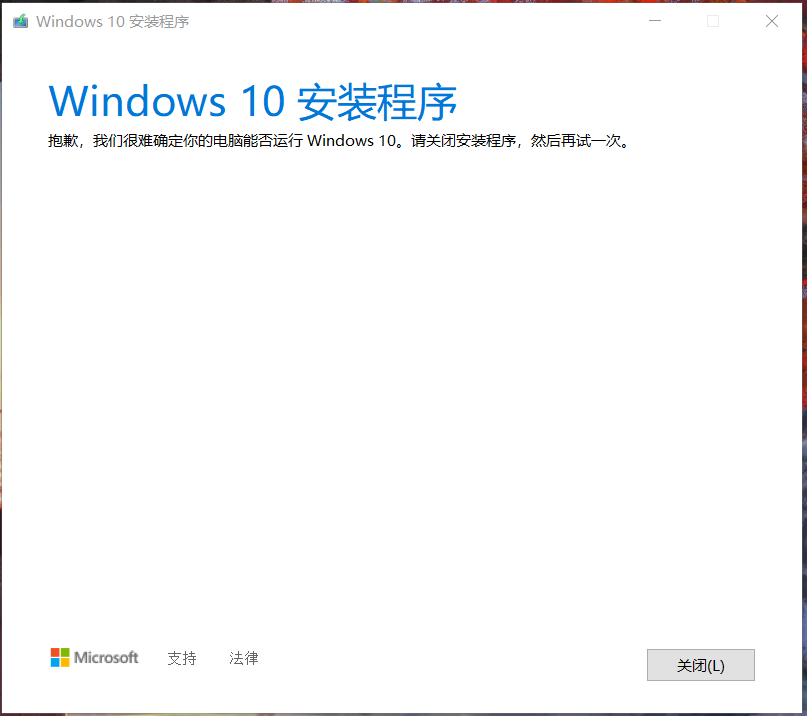
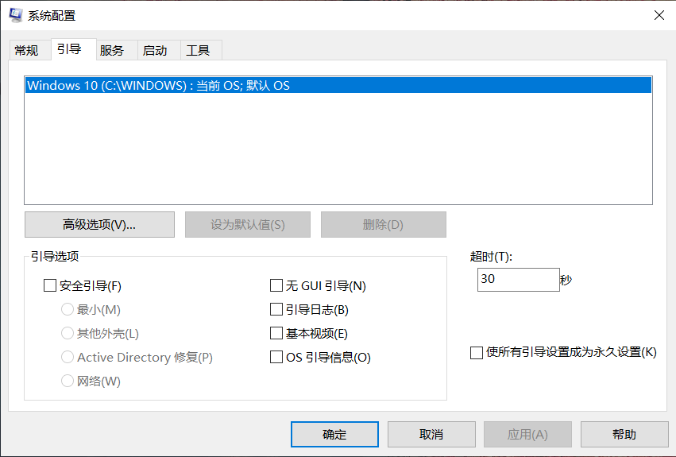

JVM垃圾回收机制(GC)。

<!-- more -->

windows10更新问题
---

### 问题描述：

1、在设置中进行质量或其他更新，重启后在更新配置到99%是，提示无法更新，然后撤销更改；

2、使用易升或更新程序（MediaCreationTool****.exe）更新，提示：“抱歉，我们很难确定你的电脑能否运行Windows 10，请关闭安装程序，然后再试一次。”；如下图。

### 解决方法：

（不一定能解决，只适用特定情况）

1、将C盘空余出40G以上的可用空间（有时20G都不够原因是系统要保留原有系统备份、解压等）

2、win+R 输入msconfig 按回车，选择引导，正常的如下图

如果为空白，会报不能此电脑是否运行的系统，是因为运行msconfig，在引导页中是空白的，看不到引导的系统（但是电脑是正常可以开机的）；造成的原因可能是你最近装过双系统。

3、修复引导，需要一个PE系统的U盘。（网上有很多PE的制作教程）

4、进入PE系统，打开DiskGenius，如下图

你的可能名字不叫ESP，可能叫分区0或其他的名称，使用DiskGenius指定盘符为x或其它可用盘符。

查看你的分区类型

我的是GPT，你的可能是MBR

5、打开PE系统的Windows10引导修复软件

a、GPT：选择 uefi  ，选择挂载地方（x盘，刚刚指定的盘符）点击修复

注：以上操作仅在我自己出问题的笔记本上操作有效，注意备份数据。
